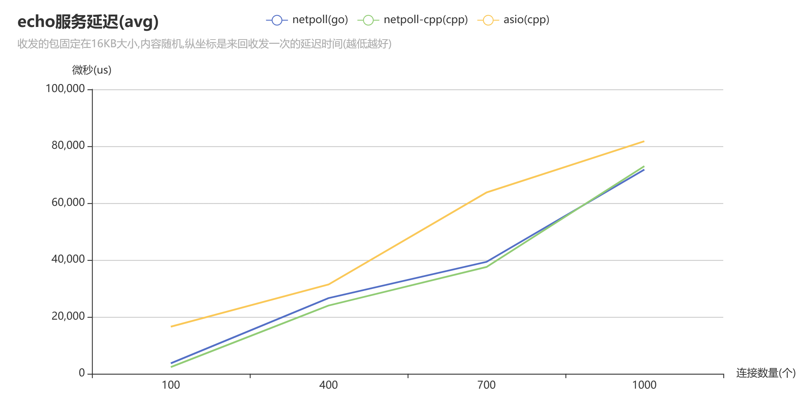
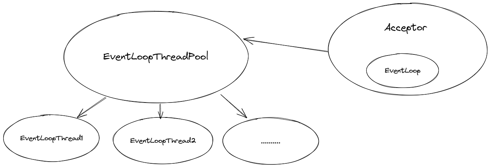
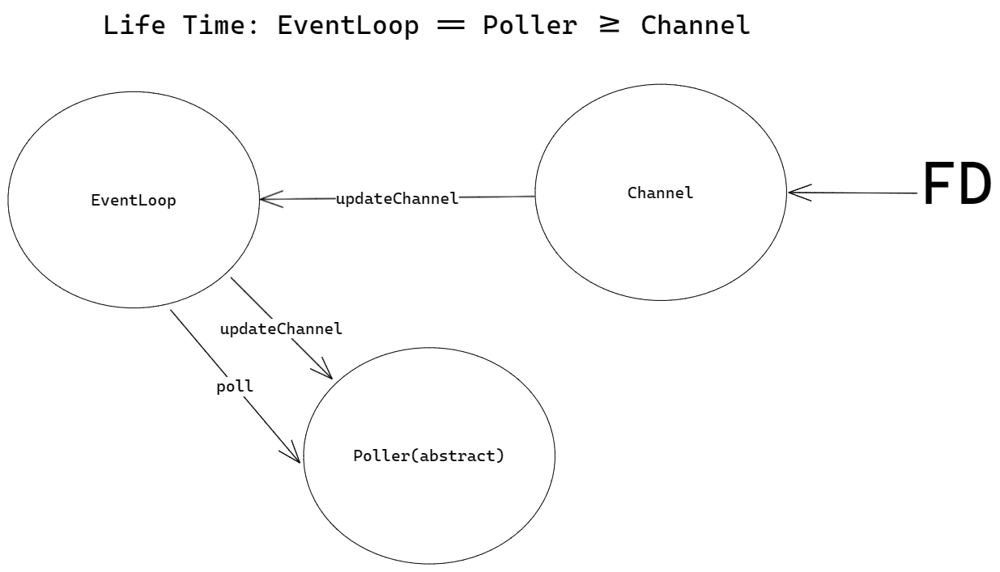

<!-- TOC -->
* [netpoll-cpp](#netpoll-cpp)
  * [概览](#概览)
    * [特性](#特性)
    * [性能](#性能)
    * [架构](#架构)
  * [快速开始](#快速开始)
    * [安装与引入](#安装与引入)
    * [开始使用](#开始使用)
      * [回调函数](#回调函数)
      * [Listener](#listener)
      * [Dialer](#dialer)
      * [EventLoop](#eventloop)
      * [MessageBuffer](#messagebuffer)
      * [TcpConnection](#tcpconnection)
  * [更多用例](#更多用例)
  <!-- TOC -->

# netpoll-cpp

[](https://github.com/ACking-you/ejson4cpp/blob/master/LICENSE)
[](https://img.shields.io/badge/Platform-Cross--platformable-blue)
[](https://en.cppreference.com/w/cpp/compiler_support/14)

## 概览

这是一个性能与易用性兼备的 `C++ NIO` 网络库,支持 `C++14` 及以上版本,并且跨三大主流平台.

底层的IO模型借鉴了 [muduo](https://github.com/chenshuo/muduo) 网络库的 `one loop per thread` 模型,该模型使得线程安全的API封装更为高效且简单.

上层提供的API接口借鉴了字节跳动开源的 go 语言 NIO 网络库 [netpoll](https://github.com/cloudwego/netpoll),抽象出 `Listener` 和 `Dialer` 最终通过 `EventLoop` 来提供服务.

关于本库的使用方式可以查看 [快速开始](#快速开始).

具体的使用范例可以查看 [examples](#更多用例).

### 特性

* **已经支持**:

    * 垮全平台 `windows/linux/macos` 各个平台分别用该平台最高性能的多路复用实现(IOCP实现的epoll/epoll/kqueue).
    * 文件的发送结合了 `EventLoop` 实现异步调用,如果所在操作系统支持 `sendfile` 调用,则会调用该零拷贝调用而不是调用C标准库.
    * 易用性超高,比如想要写一个 `echo` 服务器,只需要下面的代码:
      ```cpp
      struct server 
      {
        NETPOLL_TCP_MESSAGE(conn, buffer){conn->send(buffer->readAll());}
      };
      int main()
      {
        auto loop = netpoll::NewEventLoop();
        auto listener = netpoll::tcp::Listener::New({6666});
        listener->bind<server>();
        loop.serve(listener);
      }
      ```
    * 支持定时清理空闲连接(利用引用计数) [tcp_connection_impl.h](./netpoll/net/inner/tcp_connection_impl.h)
    * 两个层级的定时器,底层使用优先队列,支持最高和最低优先级的任务调度,上层使用时间轮,这是一个优化了内存的支持高延时的高性能时间轮(比如定时 `100^8s`,可能只需要`100*8byte`) 具体可以查看博客:[详细介绍](https://acking-you.github.io/posts/%E5%AE%9E%E7%8E%B0%E9%AB%98%E6%80%A7%E8%83%BD%E6%97%B6%E9%97%B4%E8%BD%AE%E7%94%A8%E4%BA%8E%E8%B8%A2%E5%87%BA%E7%A9%BA%E9%97%B2%E8%BF%9E%E6%8E%A5/).
    * 高性能的MPSC队列,正好和 `one loop per thread` 模型非常匹配.[lockfree_queue](./netpoll/util/lockfree_queue.h)
    * 支持异步缓冲域名解析. [resolver](./netpoll/net/resolver.h) [resolver_impl](./netpoll/net/inner/resolver_impl.h)
    * 支持作为守护线程的启动方式(serveAsDaemon),它将返回一个 `future` 用于同步,这在客户端编程中可能很有用.
    * 支持优雅的捕获相关信号做优雅退出处理,比如下列代码:
      ```cpp
      netpoll::SignalTask::Register({SIGINT,SIGTERM});
      netpoll::SignalTask::Add([](){
      //do something	
      });
      ```
    * 日志库使用 [elog4cpp](https://github.com/ACking-you/elog4cpp) 性能和易用性都极高.
    * 依赖轻量(使用[CPM](https://github.com/iauns/cpm)管理依赖),支持通过cmake命令一键导入使用.

* **将来会支持**:
    * 增加UDP的封装.
    * 增加Unix Domain Socket 的封装.
    * 引入OpenSSL支持权限认证.
    * 后续打算基于这个网络库封装一个http框架,类似于go语言的 [gin](https://github.com/gin-gonic/gin)

### 性能

性能极高,暂时测试了[asio](https://www.boost.org/doc/libs/1_82_0/doc/html/boost_asio.html)(C++)/[netty](https://netty.io/wiki/index.html)(java)/[netpoll](https://www.cloudwego.io/zh/docs/netpoll/)(go语言).

在Windows系统下测试了 asio/netty ,而下列图表测试基于Linux,而我不太会在Linux上部署Java程序,所以下列图表没有netty的性能表现.

* 不同并发情况下单个连接echo服务的平均延迟如下(avg):

  

* p99图表数据如下:

  

具体的测试结果请查看:[bench_echo](https://github.com/ACking-you/bench_echo) .

### 架构

* 总体上的客户端到服务端的架构:

  

* 服务端的底层模型架构:
  
  图中表现的并不是单纯的线程池模型,应该叫做事件循环线程池,这个所谓的线程池并不会像其他线程池一样仅为了执行队列中的任务.这个线程池只是为了获取某个可用的事件循环而已,每个事件循环单独占用一个线程,通过 `epoll`
  或其他多路复用的调用天然的形成了多生产者单消费者的模型,所以每次连接一到达就将该连接扔给一个事件循环,接下来该连接的所有事件和任务的执行都通过该事件循环.

* 基于 `one loop per thread` 模型的整个 `EventLoop` 架构:
  
  需要注意上述类的生命周期问题,利用上述的架构,把文件描述符各个事件的监听以及对应事件的回调都通过 `Channel`
  类给独立开来,且 `EventLoop` 类可以基于 `Poller`
  的相关事件监听以及阻塞调用在空闲的时候实现一个多生产者单消费者的消费模式(通过event fd 事件的监听实现这一模式).

## 快速开始

### 安装与引入

推荐使用以下两种方式进行引入:

* 方法一：通过cmake中的 `FetchContent` 模块引入(cmake >= 3.14).

    1. 在项目的cmake中添加下列代码进行引入，国内如果因为网络问题无法使用可以换这个gitee的镜像源：https://gitee.com/acking-you/netpoll-cpp.git
       ```cmake
       include(FetchContent)
       FetchContent_Declare(
         netpoll-cpp
         GIT_REPOSITORY https://github.com/ACking-you/netpoll-cpp.git
         GIT_TAG origin/master
         GIT_SHALLOW TRUE)
       FetchContent_MakeAvailable(netpoll-cpp)
       ```
    2. 在需要使用该库的目标中链接 `netpoll` 即可。

       ```cmake
       target_link_libraries(target  netpoll)
       ```

* 方法二：手动下载包，然后通过cmake命令引入.

    1. 通过git命令下载项目源码

       ```shell
       git clone https://github.com/ACking-you/netpoll-cpp.git
       ```

    2. 将该项目添加到子项目中：

       ```cmake
       add_subdirectory(netpoll-cpp)
       ```

    3. 在需要使用该库的目标中链接 `netpoll` 即可。

       ```cmake
       target_link_libraries(target  netpoll)
       ```

### 开始使用

以一个简单的echo服务的例子来讲解基本的使用.

[server.cc](./examples/echo_server_example.cc):

```cpp
#include <elog/logger.h>
#include <netpoll/core.h>

using namespace netpoll;

struct test_server
{
   NETPOLL_TCP_MESSAGE(conn, buffer) { conn->send(buffer->readAll()); }
};

int main()
{
   elog::GlobalConfig::Get().setLevel(elog::kTrace);
   auto loop     = NewEventLoop();
   auto listener = tcp::Listener::New({6666});
   listener->bind<test_server>();
   loop.serve(listener);
}
```

[client.cc](./examples/echo_client_example.cc):

```cpp
#define ENABLE_ELG_LOG
#include <elog/logger.h>
#include <netpoll/core.h>

using namespace elog;

std::string input()
{
   std::cout << "please enter you message:";
   std::string ret;
   std::cin >> ret;
   return ret;
}

struct client
{
   NETPOLL_TCP_CONNECTION(conn)
   {
      if (conn->connected()) { conn->send(input()); }
   }
   NETPOLL_TCP_MESSAGE(conn, buffer)
   {
      ELG_INFO("msg received:{}", buffer->readAll());
      conn->send(input());
   }
};

int main()
{
   elog::GlobalConfig::Get().setLevel(elog::kTrace);
   auto loop   = netpoll::NewEventLoop(1);
   auto dialer = netpoll::tcp::Dialer::New({"127.0.0.1", 6666});
   dialer->bind<client>();
#if __cplusplus >= 201703L || (_MSC_VER && _MSVC_LANG >= 201703L)
#else
   netpoll::tcp::Dialer::Register<client>();
   dialer->bindOnMessage<client>();
   dialer->bindOnConnection<client>();
#endif
   loop.serve(dialer);
}
```

观察上述代码,我们应该注意到所有的动作都基于回调函数,这也是基于 `NIO` 的网络库一贯的作风.

为了简化回调函数绑定的过程,我对 `Listener` 类或者是 `Dialer` 类提供了一键绑定类的方式 `bind()`
通过调用这个模板将自动在其内部创建一个类的实例,并把类对应的方法注册到相应的回调函数上,这其中运用了一些元编程的技术.

`elog::GlobalConfig::Get().setLevel(elog::kTrace)`
这段代码是对全局的日志输出等级进行配置,由于使用的是 [elog4cpp](https://github.com/ACking-you/elog4cpp)这个库,所以支持的配置项也非常的丰富,也是支持通过文件来进行配置,具体的使用方式请查看 [elog4cpp](https://github.com/ACking-you/elog4cpp)的文档说明,这里不会对日志库的使用进行过多赘述.

#### 回调函数

所有的回调函数均通过宏提供了签名,不需要通过继承接口来实现,也不需要手动来书写对应的方法签名.

* `NETPOLL_TCP_CONNECTION` : 建立连接或断开连接的那一刻触发的回调,一般通过 `connected` 方法和 `disconnected`
  方法判断当前连接的状态来使用.
* `NETPOLL_TCP_MESSAGE` : 连接建立后,如果收到消息后都会调用该回调,需要注意的是,底层已经帮你把数据读取到对应的Buffer中了,所以如果没有读取完这个Buffer中的内容,可能会导致需要下次消息到来才能触发回调.
* `NETPOLL_TCP_WRITE_COMPLETE` :
  当你发送数据时可能不是一次性就发完,因为写缓冲区可能已经满了,需要通过监听写事件,可能需要经过几次循环才能写完,在这种需要经过几次循环才写完的情况下,在写完数据后就会触发该回调,正常一次写完的情况不会触发.
* `NETPOLL_TCP_CONNECTION_ERROR` : 这个回调仅仅用于 `tcp::Dialer` 类,当 connect 连接失败时会调用该回调.
* `setHighWaterMarkCallback` : 这是 `TcpConnection`
  接口提供的方法,用于设置该连接的高水位回调触发,所谓高水位是你自己设置的大小,当写缓冲区满了且未写入的数据大于你设置的这个大小就会触发该回调.

关于回调的时机,我在前面的架构图中其实已经说明了部分:


#### Listener

`Listener` 的封装简化了 `TcpServer` 的使用,所有的调用如下:

```cpp
namespace netpoll::tcp{
    class Listener{
        template<typename T>
		void bind(Args &&...args); // 用于绑定任意类的对应方法到回调
        
        template <typename T>
		std::shared_ptr<T> instance() // 返回内部帮你创建的实例
        
        static ListenerPtr New(const InetAddress &address,
                                 const StringView  &name = "tcp_listener",
                                 bool reUseAddr = true, bool reUsePort = true); // 建立Listener实例
        
        void enableKickoffIdle(size_t timeout); // 用于开启剔除空闲连接
    }
}
```

#### Dialer

`Dialer` 的封装简化了 `TcpClient` 的使用,所用调用如下:

```cpp
namespace netpoll::tcp{
    class Dialer{
        template<typename T>
		void bind(Args &&...args); // 用于绑定任意类的对应方法到回调
        
        template <typename T>
		std::shared_ptr<T> instance() // 返回内部帮你创建的实例
        
        static ListenerPtr New(const InetAddress &address,
                                 const StringView  &name = "tcp_dialer"); // 建立Listener实例
        
        void enableRetry(); // 在连接失败后重试
        
        // 以下调用方均是为了在没有C++17的if constexpr情况下的替代品,否则应该直接使用bind
        template <typename T, typename... Args>
   		static std::shared_ptr<T> Register(Args &&...args);
        
        void onMessage(netpoll::RecvMessageCallback const &cb);
        
        void onConnection(netpoll::ConnectionCallback const &cb);
        
        void onConnectionError(netpoll::ConnectionErrorCallback const &cb);
        
        void onWriteComplete(netpoll::WriteCompleteCallback const &cb);
    }
}
```

#### EventLoop

`EventLoop` 的负载均衡策略没有单独设置选项,用的都是 `Round Robin` .

EventLoop相关的API如下:

* `NewEventLoop(size_t threadNum=2,const netpoll::StringView&name="eventloop")` : 建立 EventLoop 实例,可以设置 EventLoop 的线程数量.
* `serve` 方法: 当你 New 出 Dialer 或 Listener 后可以通过该方法为他们提供服务.

* `serveAsDaemon` 方法: 与 serve 方法的效果是一样的,但是是开一个新的线程去 serve ,不会阻塞当前线程.
* `enableQuit` 方法: 允许主动调用循环退出的方法,默认无法主动退出所有的循环线程,配合 `QuitAllEventLoop` 方法使用.
* `QuitAllEventLoop` 方法:退出所有的循环.

#### MessageBuffer

MessageBuffer是用于读写内核缓冲区数据的中间缓存,其实就是一个可变的缓冲区,实现起来也很比较简单,关于不同种类的缓冲区实现可以看看我的这篇文章:[可变长与不可变长buffer的实现]()

这里就不对各种调用进行描述了,想要了解的可以直接看对应的头文件: [netpoll/util/message_buffer.h](netpoll/util/message_buffer.h) .

简单讲一下实现该缓冲区的亮点:

1. 扩容时避免resize的副作用导致无意义的赋值,同时也可以简化内存开辟和复制的操作.

   ```cpp
   void MessageBuffer::ensureWritableBytes(size_t len)
   {
      if (writableBytes() >= len) return;
      // move readable bytes
      if (m_head + writableBytes() >= (len + kBufferOffset))
      {
         std::copy(begin() + m_head, begin() + m_tail, begin() + kBufferOffset);
         m_tail = kBufferOffset + (m_tail - m_head);
         m_head = kBufferOffset;
         return;
      }
      // create new buffer
      size_t newLen;
      if ((m_buffer.size() * 2) > (kBufferOffset + readableBytes() + len))
         newLen = m_buffer.size() * 2;
      else newLen = kBufferOffset + readableBytes() + len;
      // Avoid the inefficiency of using resize
      MessageBuffer newbuffer(newLen);
      newbuffer.pushBack(*this);
      swap(newbuffer);
   }
   ```

2. 提供 readFd 方法,该方法读取对应 fd 的读缓冲区的数据到 MessageBuffer ,每次读取的内容都足够的大,比如MessageBuffer可写区域如果小于8kb,那么就启用8kb的备用读取缓存.

   ```cpp
   ssize_t MessageBuffer::readFd(int fd, int *retErrno)
   {
      char         extBuffer[8192];
      struct iovec vec[2];
      size_t       writable = writableBytes();
      vec[0].iov_base       = begin() + m_tail;
      vec[0].iov_len        = static_cast<int>(writable);
      vec[1].iov_base       = extBuffer;
      vec[1].iov_len        = sizeof(extBuffer);
      const int iovcnt      = (writable < sizeof extBuffer) ? 2 : 1;
      ssize_t   n           = ::readv(fd, vec, iovcnt);
      if (n < 0) { *retErrno = errno; }
      else if (static_cast<size_t>(n) <= writable) { m_tail += n; }
      else
      {
         m_tail = m_buffer.size();
         pushBack({extBuffer, n - writable});
      }
      return n;
   }
   ```

#### TcpConnection

TcpConnection类是一个抽象类,在使用时都是通过智能指针来使用.

该接口规范了下列功能:

* 发送数据(包括string/buffer/file/stream).

  ```cpp
     /**
      * @brief Send some data to the peer.
      *
      * @param msg
      * @param len
      */
     virtual void send(StringView const &msg)                        = 0;
     virtual void send(const MessageBuffer &buffer)                  = 0;
     virtual void send(MessageBuffer &&buffer)                       = 0;
     virtual void send(const std::shared_ptr<MessageBuffer> &msgPtr) = 0;
  
     /**
      * @brief Send a file to the peer.
      *
      * @param fileName in UTF-8
      * @param offset
      * @param length
      */
     virtual void sendFile(StringView const &fileName, size_t offset = 0,
                           size_t length = 0) = 0;
     /**
      * @brief Send a stream to the peer.
      *
      * @param callback function to retrieve the stream data (stream ends when a
      * zero size is returned) the callback will be called with nullptr when the
      * send is finished/interrupted, so that it cleans up any internal data (ex:
      * close file).
      * @warning The buffer size should be >= 10 to allow http chunked-encoding
      * data stream
      */
     // (buffer, buffer size) -> size
     // of data put in buffer
     virtual void sendStream(
       std::function<std::size_t(char *, std::size_t)> callback) = 0;
  ```

* 获得连接信息,如地址信息或连接状态或接收数据的Buffer.

  ```cpp
     /**
      * @brief New the local address of the connection.
      *
      * @return const InetAddress&
      */
     virtual const InetAddress &localAddr() const = 0;
  
     /**
      * @brief New the remote address of the connection.
      *
      * @return const InetAddress&
      */
     virtual const InetAddress &peerAddr() const = 0;
  
     /**
      * @brief Return true if the connection is established.
      *
      * @return true
      * @return false
      */
     virtual bool connected() const = 0;
  
     /**
      * @brief Return false if the connection is established.
      *
      * @return true
      * @return false
      */
     virtual bool disconnected() const = 0;
  
     /**
      * @brief New the buffer in which the received data stored.
      *
      * @return MsgBuffer*
      */
     virtual MessageBuffer *getRecvBuffer() = 0;
  ```

* 设置连接回调或状态(断开连接或设置tcpNoDelay/keepAlive).

  ```cpp
     /**
      * @brief Set the high water mark callback
      *
      * @param cb The callback is called when the data in sending buffer is
      * larger than the water mark.
      * @param markLen The water mark in bytes.
      */
     virtual void setHighWaterMarkCallback(const HighWaterMarkCallback &cb,
                                           size_t markLen) = 0;
  
     /**
      * @brief Set the TCP_NODELAY option to the socket.
      *
      * @param on
      */
     virtual void setTcpNoDelay(bool on) = 0;
  
     /**
      * @brief Shutdown the connection.
      * @note This method only closes the writing direction.
      */
     virtual void shutdown() = 0;
  
     /**
      * @brief Close the connection forcefully.
      *
      */
     virtual void forceClose() = 0;
  
     /**
      * @brief Call this method to avoid being kicked off by TcpServer, refer to
      * the kickoffIdleConnections method in the TcpServer class.
      *
      */
     virtual void keepAlive() = 0;
  
     /**
      * @brief Return true if the keepAlive() method is called.
      *
      * @return true
      * @return false
      */
     virtual bool isKeepAlive() = 0;
  ```

* 设置该连接的上下文,用于处理该连接的专用业务逻辑.

  ```cpp
     /**
      * @brief Set the custom data on the connection.
      *
      * @param context
      */
     void setContext(const Any &context) { m_context = context; }
     void setContext(Any &&context) { m_context = std::move(context); }
  
     /**
      * @brief New mutable context
      *
      * @return Any
      */
     Any &getMutableContext() { return m_context; }
  
     /**
      * @brief New unmutable context
      *
      * @return Any
      */
     Any const &getContext() const { return m_context; }
  
     /**
      * @brief Return true if the custom data is set by user.
      *
      * @return true
      * @return false
      */
     bool hasContext() const
     {
  #if __cplusplus >= 201703L
        return m_context.has_value();
  #else
        return m_context.empty();
  #endif
     }
  
     /**
      * @brief Clear the custom data.
      *
      */
     void clearContext()
     {
  #if __cplusplus >= 201703L
        m_context.reset();
  #else
        m_context.clear();
  #endif
     }
  ```

* 该连接累计收发的数据量.

  ```cpp
     /**
      * @brief Return the number of bytes sent
      *
      * @return size_t
      */
     virtual size_t bytesSent() const = 0;
  
     /**
      * @brief Return the number of bytes received.
      *
      * @return size_t
      */
     virtual size_t bytesReceived() const = 0;
  ```

* 获取该连接对应的Loop.

  ```cpp
     /**
      * @brief New the event loop in which the connection I/O is handled.
      *
      * @return EventLoop*
      */
     virtual EventLoop *getLoop() = 0;
  ```

## 更多用例

暂时提供了下面两个用例:

* [examples/http](./examples/http) : 解析HTTP协议并提供文件下载服务(
  经实测可以把带宽跑满,对比其他语言的HTTP框架在我本地路由器上只能跑最多18m/s,而我这个可以跑到70m/s)
* [examples/chat](./examples/chat) : 一个简单的多人聊天室.
